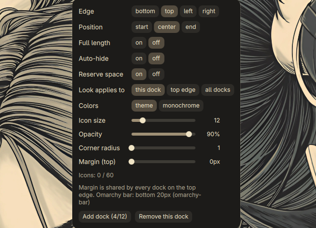

# Omarchy Multi-Docks

An [Omarchy](https://omarchy.org) shell service that gives you up to twelve independent docks: pinned apps, drag-to-reorder icons, live window previews, right-click app menus, auto-hide, reserved screen space, per-edge margins and theme-aware colors.

A dock appears at the bottom of the screen the first time you enable the plugin. Click **+** to pin apps, right-click empty dock space to open its settings, and add more docks on any edge when one is not enough.



## Features

- **Up to 12 docks, 3 per edge**: put docks on the bottom, top, left and right edges at the same time. Docks on the same edge share it in equal slots, so they never overlap.
- **Pinned apps from desktop entries**: click **+**, search by name, click an app. Apps already pinned to that dock are hidden from the list, and the list is sorted alphabetically.
- **Drag to reorder**: press an icon and drag along the dock. The other icons slide out of the way while you drag and the new order is saved when you release.
- **Smart click**: a click launches the app if it has no windows, otherwise it focuses the next window of that app, so repeated clicks cycle through all of them.
- **Live window previews**: hover an icon that has open windows to see a live capture of each window with its title. Click a card to focus that exact window. The preview stays open while your pointer is on it.
- **Running indicator**: a small dot in your accent color marks every app that has open windows. It sits on the side of the icon facing the screen edge, so it follows the dock to any edge.
- **Right-click app menu**: *New window*, the app's own desktop actions (for example "New private window"), one *Focus* entry per open window, *Close window(s)* and *Remove from dock*.
- **Auto-hide**: the dock slides off screen and leaves a thin strip on the edge. Touch the strip to bring it back. It stays open while a menu or popup is open and lingers briefly after the pointer leaves, so it never snaps shut under your cursor.
- **Reserve space**: push tiled windows out of the dock's way. Combined with auto-hide, the space is held only while the dock is visible and given back the moment it hides.
- **Per-edge margin**: set the gap between the dock and the screen edge from 0 to 64 px. One value per edge, shared by every dock on that edge.
- **Sits above the Omarchy bar**: when a dock shares an edge with the Omarchy bar, it is placed on the inner side of the bar instead of covering it. Docks on neighbouring edges start after the bar as well.
- **Theme or monochrome colors**: `theme` follows the active Omarchy theme live, `monochrome` is a fixed dark grey with white accents. Each dock keeps its own choice.
- **Look scope**: apply colors, opacity and corner radius to one dock, to every dock on its edge, or to all docks in one click.
- **Full styling per dock**: icon size, background opacity and corner radius are separate sliders.
- **Flexible placement**: choose the edge, align the dock to the start, center or end of that edge, or stretch it to the full length.
- **Click-through margins**: only the dock itself catches the mouse. The margin, the empty part of the window and the hidden dock do not block clicks on the windows beneath.
- **Layout guard**: if a change would not leave enough room for the icons (smaller screen, bigger icons, more docks), the plugin refuses it and tells you why instead of clipping icons.
- **No dependencies**: no helper scripts, no install hooks, no network and no sudo.

## Install

```bash
omarchy plugin add https://github.com/qempexe/omarchy-multi-docks.git --enable --yes
```

Or by hand: copy this directory to `~/.config/omarchy/plugins/io.github.qempexe.multi-docks/` (the folder name must match the plugin id), then:

```bash
omarchy-shell shell rescanPlugins
omarchy plugin enable io.github.qempexe.multi-docks
```

This plugin is a service, so there is nothing to add to your bar layout. Restart the shell once:

```bash
omarchy restart shell
```

### See it work in 2 minutes

1. A starter dock appears at the bottom. Click **+** and pin two or three apps.
2. Open one of them, then hover its icon to see the live preview.
3. Drag an icon to a new position.
4. Right-click empty dock space, turn **Auto-hide** on and move the pointer away. Touch the screen edge to bring it back.
5. Open the settings again and use **Add dock** to create a second dock on another edge.

## Usage

| Action | How |
| --- | --- |
| Pin an app | Click **+**, search, click an app |
| Reorder | Press and drag an icon along the dock, release to drop |
| Launch an app | Click its icon when it has no windows |
| Focus / cycle windows | Click an icon of an app that has windows. Each click moves to the next window |
| Window previews | Hover an icon that has open windows, click a preview to focus that window |
| App menu | Right-click an icon |
| Open dock settings | Right-click empty dock space or right-click **+** |
| Reveal an auto-hidden dock | Move the pointer onto the strip left on the screen edge |
| Close a popup | Click anywhere outside it |
| Change a slider | Click or drag the track, or scroll over it (hold **Shift** to scroll in steps of 5) |

A dot on an icon means the app has open windows. When a dock is full, **+** turns into **⋯** and opens the settings instead.

### The app menu

| Entry | What it does |
| --- | --- |
| New window | Starts a fresh instance of the app |
| App actions | Every action defined in the app's desktop entry |
| Focus: *title* | One entry per open window, focuses that window |
| Close window(s) | Closes all windows of the app |
| Remove from dock | Unpins the app from this dock |

## Settings

Right-click empty dock space to open the settings of that dock. Everything applies instantly and is saved to `~/.config/omarchy-dock/config.json`.

### Placement

| Setting | File key | Default | Meaning |
| --- | --- | --- | --- |
| Edge | `edge` | bottom | `bottom`, `top`, `left` or `right` |
| Position | `align` | center | `start`, `center` or `end` of that edge (inside the dock's slot) |
| Full length | `stretch` | off | Stretch the dock across the whole slot instead of fitting only the icons |
| Margin | `margins.<edge>` | 6 | Gap in px between the screen edge (or the Omarchy bar) and the docks, 0 to 64. Shared by every dock on that edge |

### Behaviour

| Setting | File key | Default | Meaning |
| --- | --- | --- | --- |
| Auto-hide | `autohide` | off | Slide away until the pointer touches the edge strip |
| Reserve space | `reserve` | on | Keep tiled windows out of the dock's area. Shared by every dock on that edge. With auto-hide on, the space is held only while the dock is visible |

### Look

| Setting | File key | Default | Meaning |
| --- | --- | --- | --- |
| Look applies to | n/a | this dock | How far Colors, Opacity and Corner radius reach: `this dock`, `<edge> edge` or `all docks`. Not saved, it resets when the shell restarts |
| Colors | `style` | theme | `theme` follows the active Omarchy theme, `monochrome` is fixed grey and white |
| Icon size | `size` | 44 | Icon size in px, 1 to 64 |
| Opacity | `opacity` | 90 | Dock background opacity in percent, 1 to 100 |
| Corner radius | `radius` | 16 | Roundness of the dock in px, 1 to 64 |

### Managing docks

| Control | What it does |
| --- | --- |
| Add dock (n/12) | Creates a new empty dock on the edge with the fewest docks, as long as there is room |
| Remove this dock | Deletes this dock. The last remaining dock cannot be removed |
| Icons: n / max | How many icons this dock holds and how many fit at the current size and screen length |

### Config file

```json
{
  "docks": [
    {
      "apps": ["firefox", "kitty"],
      "edge": "bottom",
      "align": "center",
      "stretch": false,
      "autohide": false,
      "reserve": true,
      "style": "theme",
      "size": 44,
      "opacity": 90,
      "radius": 16
    }
  ],
  "margins": { "top": 6, "bottom": 6, "left": 6, "right": 6 }
}
```

- `apps` are desktop entry ids, in dock order.
- Missing keys fall back to the defaults above. Margins are clamped to 0 to 64.
- The file is read when the shell starts. If you edit it by hand, run `omarchy restart shell` afterwards.

## Advantages

### Everyday use

- **Fast to set up**: a working dock exists from the first start, and pinning an app is two clicks.
- **Everything in one place**: pinning, reordering, previews, menus and settings all live on the dock itself, with no separate settings app.
- **Instant feedback**: every setting applies the moment you change it, no restart and no apply button.
- **Window-aware, not just a launcher**: dots, focus cycling, per-window focus and close make it useful for switching, not only for starting apps.
- **Previews you can trust**: they are live captures of the real window, not static icons.
- **Menus that match the app**: the right-click menu includes the actions the app itself declares, so you get its "new private window" and similar shortcuts for free.
- **No accidental closes**: drag, click and right-click are separate gestures, and a drag needs a deliberate move before it starts.

### Layout and flexibility

- **Four edges at once**: a bottom dock for daily apps, a left dock for tools, a top dock for something else, all at the same time.
- **Many docks, one plugin**: up to 12 docks, each with its own apps, size, colors and behaviour.
- **Per-dock behaviour**: one dock can auto-hide while another stays fixed and reserves space.
- **Per-edge margins**: set the spacing once for an edge and every dock there follows it.
- **Edge-wide look controls**: restyle all docks on an edge, or all docks, with one click instead of touching each one.
- **Aligns where you want it**: start, center or end of the edge, or full length for a classic panel look.
- **Docks cooperate**: slots, bar offsets and neighbouring docks are calculated together, so docks on different edges avoid each other's corners.
- **Safe changes**: the plugin refuses settings that would make icons overflow and explains what to change.

### Omarchy integration

- **Follows your theme**: switch the Omarchy theme and every `theme` dock changes color within about a second.
- **Respects the bar**: docks are placed above the Omarchy bar on its edge instead of covering it, and the detected bar is reported in the settings so you can see what the plugin found.
- **Real reserved space**: other windows are pushed out of the dock's way using the compositor's own mechanism, not by faking it.
- **Auto-hide that gives space back**: with reserve and auto-hide both on, tiled windows use the full screen while the dock is hidden and make room only when it shows.
- **Auto-hide that really reaches the edge**: the reveal strip sits on the very edge even when you use a margin.
- **Click-through design**: margins, gaps between docks and hidden docks never swallow clicks meant for windows underneath.

### Safety and maintenance

- **Tiny footprint**: it reads your theme file and desktop entries, writes one config file and one cache file, and nothing else.
- **No network, no sudo, no install hooks, no extra packages.**
- **Plain-text rendering**: window titles, app names, desktop action names and bar layer names come from other programs, so every label in the dock is drawn as plain text. A window titled with HTML or an image tag is shown literally and can never make the shell fetch anything.
- **Plain text config**: one readable JSON file that is easy to back up, version or copy to another machine.
- **Small, readable code**: a handful of QML files, easy to audit before enabling and easy to modify.
- **Clean removal**: removing the plugin leaves nothing running, and the optional cleanup is two commands.

## Disadvantages

- **Hyprland only**: previews, focus handling and bar detection use Hyprland-specific parts of Quickshell and `hyprctl`. It will not work on another compositor.
- **Primary screen only**: docks open on the shell's default monitor. There is no per-dock monitor setting and no multi-monitor support yet.
- **Pinned apps only**: apps that are running but not pinned do not appear in the dock. It is a launcher with window awareness, not a full task switcher.
- **Desktop entries only**: only apps that have a desktop entry can be pinned.
- **App matching can miss**: windows are matched to icons by app id. An app whose window id differs from its desktop entry can show no dot and no preview, and clicking it launches a new instance instead of focusing the existing window.
- **Hard limits**: 12 docks in total, 3 per edge, and a limited number of icons per dock that depends on icon size and screen length.
- **Bar detection is a heuristic**: the bar is found by name or by shape, and re-checked every few seconds. A bar with an unusual name or shape may not be found, and a change of bar size takes a few seconds to show. The workaround is to raise the margin on that edge.
- **Reserve space and auto-hide together re-tile your windows**: every time the dock shows or hides, tiled windows resize. If that feels busy, use either reserve or auto-hide, not both.
- **Reserve and margin are edge-wide**: changing them on one dock changes every dock on that edge, which can surprise you when the rest of the settings are per dock.
- **Look scope is not remembered**: "Look applies to" returns to *this dock* after a shell restart.
- **Close closes everything**: *Close window(s)* closes every window of that app at once. There is no per-window close entry.
- **Mouse-centred**: there is no keyboard navigation for the dock, and the sliders are mouse or scroll only.
- **No extras of full-featured docks**: no notification badges, progress bars, tooltips, folders or stacks, dragging files onto icons, or dragging icons between docks.
- **Colors are limited**: two color modes only (theme or monochrome), with no custom color picker.
- **Hand edits need a restart**: the config file is read at startup and only margins are range-checked, so a typo in other values can give odd results.
- **Frequent small writes**: dragging a slider saves the config on every step.
- **Previews depend on the compositor**: they use the screen-capture protocol, so they only work for windows the compositor allows the shell to capture, and capturing costs a little while a preview is open.
- **Not sandboxed**: like every Omarchy plugin it runs with the shell's privileges, so review the QML before enabling it.

## How it works

- **One window per dock.** A layer-shell panel on the `Top` layer, named `omarchy-dock`, is created for every dock. Its input region covers only the visible dock, so everything else is click-through.
- **Margin lives inside the window.** The window is icon thickness plus margin deep and the dock is inset by the margin. When the dock hides, the strip that stays visible sits on the edge itself, which is what makes the auto-hide trigger reach the screen edge.
- **Slots.** When several docks share an edge, the usable length is split evenly between them. The usable length excludes the corners taken by neighbouring edges, including the Omarchy bar and the docks on those edges.
- **Reserved space.** The compositor only honours an exclusive zone for a surface anchored to a single edge, so each edge has a tiny invisible spacer window that carries the zone. The zone is the dock thickness plus its margin, which makes the reserved band exactly as big as the dock window. Docks with auto-hide report whether they are visible, and the zone is zero while they are hidden.
- **Bar detection.** Every few seconds the service runs `hyprctl -j layers` and saves the output to a cache file. It prefers a layer whose name contains "bar" and otherwise accepts any thin strip along a screen edge. The distance from the edge to the inner side of the bar becomes an offset for docks on that edge, and a corner for docks on neighbouring edges.
- **Theme colors.** The service reads `background`, `foreground` and `accent` from the active Omarchy theme's `colors.toml` (`~/.local/state/omarchy/current/theme/colors.toml`, with the older `~/.config/omarchy/current/theme/colors.toml` as a fallback). The file is watched and also re-read every second.
- **Window matching.** Open windows come from the compositor's toplevel list and are matched to a desktop entry by app id, its startup class or the last part of its id.
- **Previews.** A preview is a popup with one live screen-capture view per window. It opens after a short hover delay, closes shortly after the pointer leaves both the icon and the preview, and is suppressed while you drag or have a menu open.
- **Popups.** Menus, the app picker, the settings and previews open on the side of the dock facing the screen. A focus grab closes them when you click elsewhere, and the app picker takes keyboard focus only while it is open.
- **Saving.** Each change writes the whole config file in the background.

## Data and privacy

- Your docks and margins live in `~/.config/omarchy-dock/config.json`. The output of `hyprctl -j layers` is cached in `~/.cache/omarchy-dock/layers.json`. Nothing else is stored.
- The plugin reads Omarchy's theme file, installed desktop entries and the list of open windows. Window captures are used only while a preview is open and are never saved.
- The only external process it runs is `hyprctl`. No network access. Text that comes from other programs (window titles, app names, action names, the bar's layer name) is always rendered as plain text, never as rich text, so it cannot trigger remote content loading.
- Plugins run unsandboxed in the shell process. This one writes only its own config and cache files.

## Files

| File | Purpose |
| --- | --- |
| `manifest.json` | Omarchy plugin manifest |
| `Service.qml` | Config, theme colors, bar detection, layout math, reserve spacers, one window per dock |
| `DockWindow.qml` | A single dock: icons, drag, previews, menus, add-app picker and settings popup |
| `Chips.qml` | Small option picker used in the settings |
| `Slider.qml` | Small slider used in the settings |
| `LICENSE` | MIT license |

## Development

Plugin files under `~/.config/omarchy/plugins/` are watched, but changes to window and layer code only show up reliably after:

```bash
omarchy restart shell
```

To check the manifest:

```bash
omarchy plugin validate .
```

To lint the QML:

```bash
qmllint -I "$OMARCHY_PATH/shell" Service.qml DockWindow.qml Chips.qml Slider.qml
```

## Updating

```bash
omarchy plugin update io.github.qempexe.multi-docks
omarchy restart shell
```

The first command pulls the latest version. The second is required because the shell doesn't reliably reload changed QML on its own, so without it you'll still be running the old code.

## Uninstall

```bash
omarchy plugin remove io.github.qempexe.multi-docks
omarchy restart shell
```

To also delete your saved docks and the cache:

```bash
rm -rf ~/.config/omarchy-dock
rm -rf ~/.cache/omarchy-dock
```

Both are optional. Leave them if you might reinstall and want your docks back.

## License

[MIT](LICENSE)
